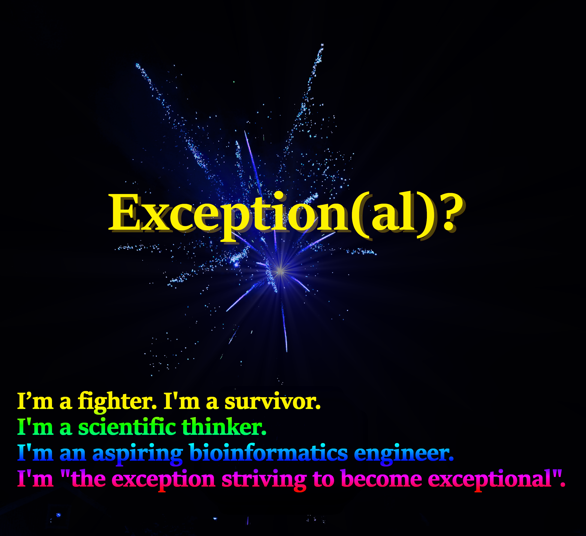

- 👋 Hi, I’m @the-exceptional-exception
- 💞️ Despite being hospitalized more than half the time of my three year long higher secondary education, I managed to get an 'A' in more than 20 of my courses included in the natural science programme. An exception, you might say.  
- 🌱 I’m currently learning bioinformatics, programming in Python, machine learning — and most importantly — I am learning how to live again!
- 👀 I’m interested in biology, mathematics and programming.
- 📫 How to reach me: the.exceptional.exception@gmail.com

## I usually work in Visual Studio Code. Other skills:
 
      

## My greatest passion?
